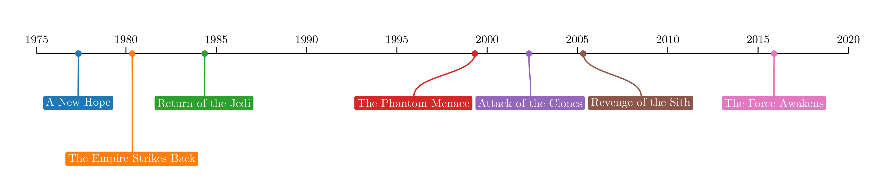
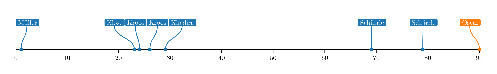

labella.py
==========

Labella.py is a Python 3 clone of 
[labella.js](https://github.com/twitter/labella.js) which supports all the 
features of labella.js and addionally can generate TikZ PDF images for use in 
LaTeX.

**Note:** This package is for the most part a direct translation of the 
original [labella.js](https://github.com/twitter/labella.js) code to Python 3.
All the credit for the labella code goes to Krist Wongsuphasawat 
([@kristw](https://twitter.com/kristw)), I only added the code which generates 
PDF output. Labella.py also includes code from 
[d3](https://github.com/mbostock/d3) for axis scaling, and 
[WebCola](https://github.com/tgdwyer/WebCola) for the VPSC code (label 
placement optimization).

Why?
----
I wrote this for multiple reasons, the most important of which is that I 
wanted to incorporate label graphs like the ones generated by 
[labella.js](https://github.com/twitter/labella.js) in PDF documents, but 
wasn't satisfied with the PDF output generated by SVG-to-PDF converters. 
Additionally, it seemed like a fun way to learn some more Javascript, and 
learn about how [labella.js](https://github.com/twitter/labella.js) works.

Screenshots
-----------
These screenshots show the PDF output generated by labella.py (converted to 
.png)

Time scale:


Linear scale:


Usage
-----
Using labella.py is extremely similar to using 
[labella.js](https://github.com/twitter/labella.js). See the 
[examples](examples) directory for examples of how to use labella.py. These 
examples are translations of the examples included in labella.js and in 
[d3kit-timeline](https://kristw.github.io/d3kit-timeline/).

For ease of use only the Timeline interface is implemented, which works 
similar to [d3kit-timeline](https://kristw.github.io/d3kit-timeline/). Here is 
a minimal working example for exporting to PDF:

```python
>>> from labella.scale import LinearScale
>>> from labella.timeline import TimelineTex
>>> tl = TimelineTex([
  {'time': 1, 'text': 'Minimal'},
  {'time': 2, 'text': 'Working'},
  {'time': 3, 'text': 'Example'}
  ], options={'scale': LinearScale()})
>>> tl.export('minimal.tex')
```

Installation
------------

Clone the repository and then use:
```
python setup.py install
```
or:
```
python setup.py install --user
```

Author
------

Gertjan van den Burg ([@GJJvandenBurg](https://twitter.com/GJJvandenBurg)).

Licensed under the [Apache License Version 
2.0](http://www.apache.org/licenses/LICENSE-2.0).
